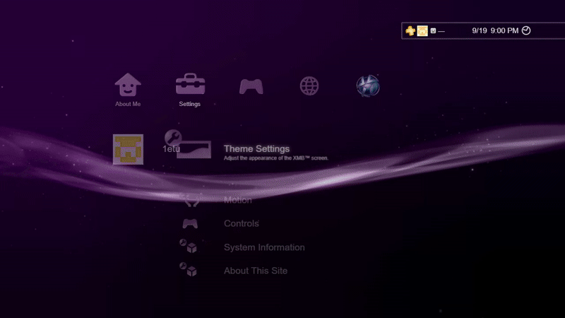

# XMP

A personal portfolio, built on XMB Web.

[Open the site](https://1etu.github.io/xmb-test-portfolio/) · [Campaign](marketing/README.md) · [Research and credits](RESEARCH.md)



## What it is

XMP puts my projects, profile, and links inside an XMB-style interface. It has the wave, theme colors, shaded icons, startup sequence, folders, and sound. Keyboard, controller, mouse, and touch use the same navigation system.

The project includes working theme settings, a profile, an Information Board, and a What's New grid. Its web view can show sites that allow embedding. Other sites open in a new tab.

## About XMBW

XMBW means **XMB Web**. It is the larger project behind this interface, and it is still in development.

I wanted to update my portfolio before XMBW was ready. XMP is that early version: a place to use the shell with real content and improve it. It is not the finished XMBW release.

## Run

The source uses Node.js 22.6 or later and pnpm 10.

```sh
pnpm install
pnpm dev
```

For a local production build, use `pnpm build` and `pnpm start`. Use `pnpm build:pages` for the static Pages build.

See [deployment notes](DEPLOYMENT.md) to publish an update.

The Node server supplies the live visitor count. GitHub Pages cannot run that server, so the static site shows a dash.

## Controls

| Action              | Keyboard            | Controller |
| ------------------- | ------------------- | ---------- |
| Navigate            | Arrow keys or WASD  | D-pad      |
| Enter               | Enter or Space      | Cross      |
| Back                | Escape or Backspace | Circle     |
| Options             | T                   | Triangle   |
| Change profile page | Page Up / Page Down | L1 / R1    |

On touch screens, swipe to navigate and tap to select.

## Under the menu

TypeScript runs the shell, navigation, and animation. React renders the interface and page content. WebGPU draws the scene, with a WebGL 2 fallback. Web Audio handles sound. Vite builds the site. Vitest and Playwright check the behavior.

## Research and credits

The reference is Sony Computer Entertainment's PS3 XrossMediaBar. Research includes Sony's manuals, PS3 Developer Wiki, RPCS3, Lineschive, and recordings of the original interface. The [research notes](RESEARCH.md) link each source and explain its role.

The campaign follows Sterling P. Sanders's [Play Beyond launch work](https://sterlingsanders.com/sony-ps3-launch-play-beyond). Its artwork and browser recordings live in [marketing](marketing/README.md).

Code and portfolio by [etu](https://github.com/1etu). Independent project, with no Sony affiliation.

## License

[MIT](LICENSE) covers the original code. Third-party artwork, icons, trademarks, and reference material retain their owners' rights. See [third-party notices](THIRD_PARTY_NOTICES.md).
