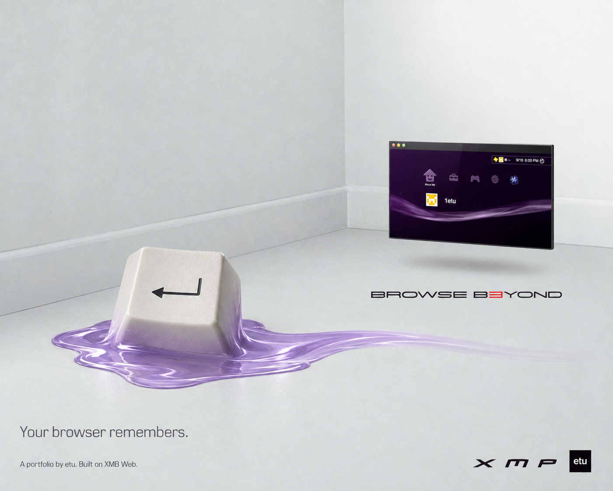

# Browse B3yond

**XMP. A portfolio by etu, built on XMB Web.**

[Open XMP](https://1etu.github.io/xmb-test-portfolio/) · [Research](../RESEARCH.md) · [Launch copy](COPY.md)

## The idea

The menu was part of the memory. XMP brings it into the browser, with a portfolio inside.

This campaign follows the White Room and outdoor prints in [Sterling P. Sanders's Play Beyond work](https://sterlingsanders.com/sony-ps3-launch-play-beyond). One strange object carries the idea. The caption stays small. The product has space around it.

## Artwork

| File                                                        | Use                         | Concept                              |
| ----------------------------------------------------------- | --------------------------- | ------------------------------------ |
| [Your browser remembers](art/01-your-browser-remembers.png) | Main print, launch post     | An Enter key melts into the wave     |
| [There is more in the menu](art/02-more-in-the-menu.png)    | Second print, project post  | A folder contains a small world      |
| [Browse B3yond](art/03-browse-beyond.png)                   | Wide banner, campaign cover | A wave crosses a canyon to a browser |

Keep each composition intact. Use the wide image for wide placements and the White Room prints for feed posts. Do not crop away the small captions or add large headings.

The lettering follows the supplied print references. It is part of the raster artwork, not a bundled font. [Generation prompts](source/prompts.md) record the inputs and constraints.

## Recordings

These show the actual Pages build at normal speed. MP4 files are 1280 × 720 without audio. GIFs are 800 pixels wide at 15 frames per second.

| Clip              | GIF                                  | MP4                                 |
| ----------------- | ------------------------------------ | ----------------------------------- |
| Startup           | [13.6 seconds](gifs/01-startup.gif)  | [Download](video/01-startup.mp4)    |
| Folder navigation | [10 seconds](gifs/02-navigation.gif) | [Download](video/02-navigation.mp4) |
| Theme changes     | [8.5 seconds](gifs/03-themes.gif)    | [Download](video/03-themes.mp4)     |
| What's New        | [7.8 seconds](gifs/04-whats-new.gif) | [Download](video/04-whats-new.mp4)  |

Use MP4 for social uploads. Use the GIFs in READMEs and places without video support. The clock is fixed for the capture. The wave and transitions still run normally.

## Stills

[Main menu](stills/01-home.png) · [Project folders](stills/02-projects.png) · [What's New](stills/03-whats-new.png)

## Release order

1. Lead with _Your browser remembers_ and the launch copy.
2. Show the navigation clip with the live link.
3. Follow with the folder print and the XMBW development note.
4. Use the theme and What's New clips for feature posts.
5. Close the set with the wide image and research credits.

The copy is ready to use. No social posts were sent.

## Credits

Art direction reference: Sony Computer Entertainment's Play Beyond launch campaign, presented by Sterling P. Sanders. New campaign imagery: OpenAI image generation, directed for XMP. Site, content, and recordings: XMP by etu.

See [research](../RESEARCH.md), [third-party notices](../THIRD_PARTY_NOTICES.md), and the [capture manifest](source/captures.json).
